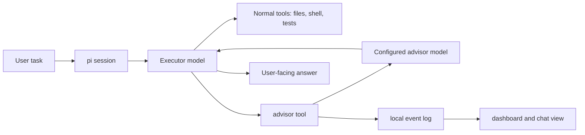

# pi-executor-advisor

A provider-agnostic **advisor tool** for [pi](https://github.com/earendil-works/pi-coding-agent) coding-agent workflows.

`pi-executor-advisor` lets your active pi model remain the **executor** while privately consulting another, usually stronger, **advisor** model for strategy, verification, and course correction. The executor keeps tool access and writes the final answer; the advisor only returns private guidance.

Inspired by:

- Anthropic: [The Advisor Strategy](https://claude.com/blog/the-advisor-strategy)
- Paper: [How to Train Your Advisor: Steering Black-Box LLMs with Advisor Models](https://arxiv.org/pdf/2510.02453)



## What problem does this solve?

Coding agents often face moments where a second model is useful:

- before touching risky code
- after initial repo orientation
- when debugging gets stuck
- when the plan may be wrong
- before declaring a difficult task complete
- when a cheap/fast executor could benefit from a stronger verifier

Most model-switching workflows make you manually copy context between models. This package gives the executor a first-class `advisor` tool. The current transcript is sent to the configured advisor model, the advisor returns concise private guidance, and the executor continues in the same pi session.

## Who is this for?

Use this if you:

- use pi for coding/research tasks
- want an executor/advisor workflow without leaving the terminal
- want to pair a fast executor with a stronger reviewer
- want advisor calls to include current transcript context automatically
- want provider-agnostic model pairing instead of a vendor-specific advisor feature

This is probably **not** what you want if you need RL-trained advisor models, automatic reward optimization, or Anthropic's native server-side advisor tool.

## Quick start

Install from GitHub:

```bash
pi install git:github.com/rbgit/pi-executor-advisor
```

Enable an advisor model in pi:

```text
/advisor-on openai/gpt-5.3
```

Or set both executor and advisor together:

```text
/advisor-pair executor:kimi-k2.5 advisor:gpt-5.5 max:3 words:120
```

Let the advisor rewrite each complex user prompt into an execution brief before the cheap executor starts:

```text
/advisor-brief auto
```

Turn on the completion judge (advisor verdicts each finished task, with one automatic fix round on FAIL), per-task model routing, and an escalation advisor:

```text
/advisor-judge auto
/advisor-route simple:haiku complex:kimi-k2.5
/advisor-escalate openai/gpt-5.5
```

Check status:

```text
/advisor-status
```

Open the local dashboard/chat server:

```text
/advisor-dashboard
```

Default URLs:

```text
http://127.0.0.1:5000/       # event dashboard
http://127.0.0.1:5000/chat   # chat-style executor/advisor view
```

Once enabled, the executor can call the `advisor` tool during coding/research tasks. The chat page will populate as new local advisor-gate events are recorded.

## Features

- **Executor/advisor split** — keep one model in control while consulting another model privately.
- **Provider agnostic** — works with any models registered in pi, not only Claude-native advisor pairs.
- **Private guidance** — advisor output is returned to the executor as tool output, not directly to the user.
- **Transcript-aware advice** — sends the current branch transcript to the advisor model.
- **Task briefs (prompt routing)** — the advisor can rewrite each user prompt into a structured execution brief (goal, plan, first actions, acceptance checks, pitfalls) injected before a cheap/fast executor starts work.
- **Focused questions** — the executor can pass an optional `focus` question to the advisor for a targeted decision check instead of a general review.
- **Completion judge** — the advisor can grade each finished task PASS/FAIL against the request and the brief's acceptance checks, automatically sending REQUIRED_FIXES back to the executor for a bounded number of retry rounds.
- **Per-task model routing** — route simple tasks to a cheaper executor and complex tasks to a stronger one, decided per prompt by the shared task classifier.
- **Escalation ladder** — after a judge failure, advisor STOP advice, or repeated consults in one task, advisor calls automatically escalate to a configured stronger model.
- **Diff-aware advice** — advisor, brief, and judge prompts include `git status`/`git diff` so critiques target the actual changes, not just narrated ones.
- **Learns from local history** — briefs mine the local advisor-gate event log for this repo's past blocked mutations and failed verdicts to sharpen PITFALLS and ACCEPTANCE_CHECKS.
- **Verifier-oriented prompting** — when a transcript already contains a plan, attempt, or tool observations, the advisor is prompted to critique concrete evidence instead of giving generic tips.
- **Configurable limits** — cap advisor calls per user task and target response length.
- **Configurable advising cadence** — nudge the executor to re-consult the advisor periodically on long multi-step tasks.
- **Model resolution helpers** — use exact `provider/model`, exact model id, or a unique fuzzy substring.
- **Local dashboard and chat view** — bundled observability extension shows advisor events at `/` and iMessage-style executor/advisor conversations at `/chat`.
- **Local-only by default** — dashboard binds to `127.0.0.1` and reads local JSONL events.

## Installation and setup

### Install from GitHub

```bash
pi install git:github.com/rbgit/pi-executor-advisor
```

SSH form:

```bash
pi install git:git@github.com:rbgit/pi-executor-advisor.git
```

### Install from a local checkout

```bash
git clone git@github.com:rbgit/pi-executor-advisor.git
cd pi-executor-advisor
pi install .
```

Or install from an absolute local path:

```bash
pi install /home/rachit/ai_projects/executor-advisor
```

### Development mode

For one-off local testing without installing the package:

```bash
pi -e ./extensions/advisor/index.ts -e ./extensions/advisor-gate/index.ts
```

For hot reload during development, place or symlink the extension under pi's auto-discovered extension directory and use `/reload` inside pi:

```bash
mkdir -p ~/.pi/agent/extensions
ln -s /home/rachit/ai_projects/executor-advisor/extensions/advisor ~/.pi/agent/extensions/advisor
ln -s /home/rachit/ai_projects/executor-advisor/extensions/advisor-gate ~/.pi/agent/extensions/advisor-gate
```

Then run `/reload` in pi after edits.

## How it works

1. You install the package, which loads two extensions:
   - `extensions/advisor/index.ts` registers the private `advisor` tool.
   - `extensions/advisor-gate/index.ts` logs advisor/executor events and serves the local dashboard/chat UI.
2. You enable the extension and configure an advisor model.
3. The advisor extension adds an `advisor` tool to pi's active tools.
4. For enabled sessions, it appends guidance telling the executor when to call the advisor.
5. When the executor calls `advisor`, the extension serializes the current conversation branch.
6. The serialized transcript is sent to the configured advisor model using pi's provider registry.
7. The advisor returns concise private guidance to the executor.
8. The advisor-gate extension records local JSONL events and renders them in the dashboard/chat server.
9. The executor remains responsible for all tool use and user-facing responses.

The advisor cannot call tools and does not directly mutate files. It only returns text guidance.

## Task briefs: routing prompts through the advisor

Cheap/fast executors (small open-weight models, mini code models, diffusion LLMs) execute well but plan poorly from vague prompts. With `/advisor-brief auto`, the advisor model intercepts each complex user prompt **before execution starts** and rewrites it into a structured execution brief:

- **GOAL** — the precise outcome, one sentence
- **SCOPE** — what is in and out of scope
- **ASSUMPTIONS** — explicit interpretations of ambiguous wording
- **PLAN** — numbered, small, independently verifiable steps
- **FIRST_ACTIONS** — exact commands to run or files to read first
- **ACCEPTANCE_CHECKS** — how the executor verifies completion
- **PITFALLS** — likely mistakes for this specific task
- **ADVISOR** — when to re-consult the advisor during execution

The brief is grounded in lightweight repo signals (top-level listing, README excerpt) and the tail of the current conversation, then injected into the session as a visible message the executor follows. The raw user request remains authoritative for intent.

Modes:

- `off` (default) — never generate briefs.
- `auto` — brief only prompts that look complex (length or implementation/debugging/architecture keywords). Trivial prompts skip the extra advisor call.
- `always` — brief every prompt.

Brief generation is best-effort: on advisor error or timeout (`briefTimeoutMs`, default 60s) the task starts normally without a brief.

```text
/advisor-pair executor:kimi-k2.5 advisor:gpt-5.5 brief:auto
```

During execution the executor can also pass a targeted question to the advisor:

```text
advisor(focus: "Is applying the schema migration before the backfill safe here?")
```

Briefs are additionally grounded in the workspace `git status`/`git diff` and in this repo's recent failure history mined from the local advisor-gate event log.

## Completion judge

With `/advisor-judge auto` (or `always`), the advisor grades each finished task:

1. When the agent loop ends, the advisor receives the user request, the execution brief (if one was generated), the workspace diff, and the transcript.
2. It returns `VERDICT: PASS` or `VERDICT: FAIL` with evidence-grounded reasons.
3. On FAIL, the judge's REQUIRED_FIXES are sent back to the executor as a follow-up message that triggers a new fix round, up to `judgeMaxRetries` rounds (default 1). After that, failures are only reported, never looped.
4. Verdicts are appended to the local advisor-gate event log, which future briefs mine for past failure modes.

`auto` judges only tasks the classifier marks as advisor-worthy; `always` judges every task. Aborted or errored runs are never judged. Set retries with `/advisor-judge auto retries:2`.

## Per-task model routing

`/advisor-route simple:<model> complex:<model>` switches the executor model per user prompt: prompts the shared classifier marks as advisor-worthy (implementation, debugging, architecture/security, data risk, large prompts) go to the `complex` model; everything else goes to `simple`. Either tier may be omitted, in which case the current model is kept for that tier. Disable with `/advisor-route off`.

## Escalation ladder

`/advisor-escalate <model>` configures a stronger fallback advisor. Advisor calls (and re-judging after a failed fix round) automatically use it when any of these hold for the current task:

- a completion judge FAIL already occurred,
- earlier advisor advice contained a STOP section,
- this is the third or later advisor call.

Escalated calls are marked in the tool output and recorded in the result details.

## Commands

| Command | Description |
|---|---|
| `/advisor-on <advisor-model>` | Enable advisor mode and configure the advisor model. |
| `/advisor-off` | Disable advisor prompt steering and remove the advisor tool from active tools. |
| `/advisor-status` | Show current executor/advisor configuration. |
| `/advisor-pair executor:<model> advisor:<model> [max:<n>] [words:<n>] [brief:<mode>] [budget:<usd>]` | Set executor and advisor models together. |
| `/advisor-max <n>` | Set maximum advisor calls per user task. |
| `/advisor-words <n>` | Set target advisor response length. |
| `/advisor-cadence <n\|off>` | Set recommended re-consult cadence for long multi-step tasks. This is prompt steering, not enforcement. |
| `/advisor-brief <off\|auto\|always>` | Have the advisor rewrite user prompts into execution briefs before the executor starts. `auto` briefs only complex-looking prompts. |
| `/advisor-judge <off\|auto\|always> [retries:<n>]` | Grade finished tasks PASS/FAIL and send REQUIRED_FIXES back to the executor on FAIL. |
| `/advisor-route simple:<model> complex:<model> \| off` | Route the executor model per task complexity. |
| `/advisor-escalate <model\|off>` | Configure a stronger escalation advisor for stuck or failed tasks. |
| `/advisor-budget <usd\|off>` | Cap total advisor spend per user task across brief, advisor calls, and judge. |
| `/advisor-reset` | Reset extension configuration to defaults. |
| `/advisor-dashboard` | Start/show the local advisor dashboard and chat server. |
| `/advisor-dashboard-stop` | Stop the local dashboard server. |
| `/advisor-gate` | Show advisor gate/log/dashboard status. |

### Model specs

Model specs may be:

- exact `provider/model`
- exact model id
- exact model name
- unique fuzzy substring

Examples:

```text
/advisor-pair executor:kimi-k2.5 advisor:gpt-5.5 max:3 words:120
/advisor-pair sonnet opus
/advisor-on openai/gpt-5.3
/advisor-on anthropic/claude-opus-4-5
```

If a fuzzy model spec matches multiple models, the command reports an ambiguity error.

## Configuration

Configuration is persisted outside the repository at:

```text
~/.pi/agent/advisor.json
```

If `PI_CODING_AGENT_DIR` is set, the config path becomes:

```text
$PI_CODING_AGENT_DIR/advisor.json
```

Default configuration:

```json
{
  "enabled": false,
  "maxUsesPerTask": 3,
  "maxWords": 120,
  "maxOutputTokens": 2048,
  "maxTranscriptChars": 120000,
  "advisorCadence": 5,
  "thinkingLevel": "off",
  "brief": "off",
  "briefMaxWords": 250,
  "briefTimeoutMs": 60000,
  "judge": "off",
  "judgeMaxRetries": 1,
  "routing": { "enabled": false },
  "maxCostPerTask": 0
}
```

`maxCostPerTask` (USD, `0` = off) caps the advisor layer per user task: once recorded brief + advisor + judge costs reach the cap, further advisor calls return a budget notice and the judge is skipped. Spend is summed from recorded usage costs, so models without pricing metadata (cost `0`) are invisible to the budget.

Optional model references (`routing.simple`, `routing.complex`, `escalation`) are set by the commands above and stored as `{ "provider": ..., "model": ..., "spec": ... }`.

Most users only need the commands above. Advanced users may edit `advisor.json` directly while pi is not running.

### Dashboard/chat server configuration

The bundled advisor-gate extension starts a local-only HTTP server by default.

| Environment variable | Default | Description |
|---|---:|---|
| `PI_ADVISOR_DASHBOARD` | enabled | Set to `0` to disable dashboard auto-start. |
| `PI_ADVISOR_DASHBOARD_PORT` | `5000` | Local dashboard/chat port. |
| `PI_ADVISOR_GATE_MODE` | `attempt` | Gate behavior: `off`, `log`, `attempt`, or `success`. |
| `PI_ADVISOR_PG_DISABLE` | unset | Set to `1` to disable optional Postgres insert attempts. |
| `PI_ADVISOR_PG_URL` | `postgres://localhost/advisor_habitat?sslmode=disable` | Optional observability Postgres URL. |

Dashboard URLs:

```text
http://127.0.0.1:5000/       # event dashboard
http://127.0.0.1:5000/chat   # chat-style executor/advisor view
http://127.0.0.1:5000/events.json
```

## Design inspiration

This package is inspired by two advisor-style model collaboration ideas:

- **"How to Train Your Advisor: Steering Black-Box LLMs with Advisor Models"** (arXiv:2510.02453), which studies trained advisor models that generate dynamic, per-instance natural-language advice for black-box student models.
- Anthropic's **"The Advisor Strategy"** blog post, which describes a practical executor/advisor split where a working model consults a stronger model for private strategic guidance.

This repository is an independent pi package. It is not affiliated with Anthropic or the paper authors, and it does **not** implement Anthropic's native advisor tool. It also does **not** implement RL training, reward optimization, transferability experiments, or advisor model fine-tuning. Instead, it implements a lightweight, provider-agnostic runtime integration for pi.

| Inspiration | This repo | Gap | Action taken |
|---|---|---|---|
| Dynamic, per-instance natural-language advice from arXiv:2510.02453 | The `advisor` tool sends the current transcript to a configured model and returns advice to the executor. | Advisor quality depends on the chosen model/prompt; no learned policy. | Kept provider-agnostic runtime design. |
| 3-step/verifier setup: student attempt → advisor critique → revised student answer | The advisor sees the transcript, including orientation, attempts, and tool observations when called. | Previously prompted mostly as broad strategy. | Updated advisor system prompt to act as a concrete verifier/critic when evidence or an attempt exists. |
| Multi-turn advising cadence | The executor chooses when to call the advisor. | Purely dynamic tool-calling can under-use advisors. | Added `/advisor-cadence` to steer periodic re-consultation every N meaningful tool/action observations. |
| Executor/advisor split from Anthropic's Advisor Strategy | The active pi model remains the executor; advisor output is private tool guidance. | This uses pi's provider registry, not Anthropic's server-side advisor pairing. | Implemented a portable client-side advisor tool. |
| RL reward training and transferability | Not implemented. | Requires training data, reward functions, and model update infrastructure outside this extension. | Documented as out of scope for this runtime package. |

## Security and privacy

Important data-flow details:

- The advisor receives a serialized transcript of the current conversation branch.
- That transcript may include user prompts, assistant messages, tool results, file paths, command output, and snippets of project content already present in the pi session.
- The advisor model is called through pi's provider registry using your configured provider credentials.
- This repository does **not** store API keys.
- Runtime config lives in `~/.pi/agent/advisor.json`, not in this repo.
- Advisor-gate event history lives in `~/.pi/agent/logs/advisor-gate.jsonl`, not in this repo.
- API keys should remain in your normal pi/provider configuration, environment, or secret manager.

Before using this extension with private code, choose an advisor model/provider whose data handling policy you trust.

### Why is chat history empty on another computer?

The advisor tool configuration and extension code can be installed from GitHub, but old chat history is local runtime data. The chat page reads:

```text
~/.pi/agent/logs/advisor-gate.jsonl
```

A fresh computer will show new conversations only after advisor-gate records events on that computer. If you want old history elsewhere, copy that JSONL file manually outside git after considering the privacy risk.

## What not to commit

Do not commit:

- `.env` files
- API keys or provider tokens
- SSH keys
- local pi config such as `advisor.json`
- logs or session transcripts
- `~/.pi/agent/logs/advisor-gate.jsonl`
- database dumps containing private conversations

The included `.gitignore` is configured to avoid common accidental secret and local artifact commits.

## Troubleshooting

### `Advisor is not configured`

Run:

```text
/advisor-on <advisor-model>
```

or:

```text
/advisor-pair executor:<model> advisor:<model>
```

### `No API key available for advisor ...`

Configure the provider/API key in pi, then retry. The extension relies on pi's model registry and provider credentials.

### `Ambiguous model spec`

Use a more specific model name or exact `provider/model` form.

Example:

```text
/advisor-on openai/gpt-5.3
```

instead of:

```text
/advisor-on gpt
```

### Advisor cadence is too frequent or too sparse

Set the suggested re-consult interval:

```text
/advisor-cadence 5
```

Disable periodic cadence guidance:

```text
/advisor-cadence off
```

This setting is prompt steering. It nudges the executor when to ask for advice, but it does not enforce tool-call timing.

### Advisor call limit reached

Increase the per-task cap:

```text
/advisor-max 5
```

or continue without further advisor calls.

### Transcript truncated

The extension truncates very large transcripts using `maxTranscriptChars`. Increase it in `~/.pi/agent/advisor.json` if needed, but expect higher token usage and cost.

## Repository layout

```text
.
├── AGENT.md
├── AGENTS.md
├── LICENSE
├── package.json
├── README.md
└── extensions/
    ├── advisor/
    │   └── index.ts
    ├── advisor-gate/
    │   └── index.ts
    └── shared/
        └── classify.ts
```

This package ships two pi extensions: the advisor tool and the advisor-gate dashboard/chat server.

## Package manifest

`package.json` declares this as a pi package:

```json
{
  "keywords": ["pi-package"],
  "pi": {
    "extensions": [
      "./extensions/advisor/index.ts",
      "./extensions/advisor-gate/index.ts"
    ]
  }
}
```

## Development

Clone the repo:

```bash
git clone git@github.com:rbgit/pi-executor-advisor.git
cd pi-executor-advisor
```

Run the extensions directly:

```bash
pi -e ./extensions/advisor/index.ts -e ./extensions/advisor-gate/index.ts
```

Install locally as a pi package:

```bash
pi install .
```

Useful inspection commands:

```bash
find . -maxdepth 4 -type f -not -path './.git/*' -print
grep -n "registerCommand\|registerTool" extensions/advisor/index.ts extensions/advisor-gate/index.ts
```

Pi loads TypeScript extensions through its runtime loader, so no compile step is required for normal local use.

## Contributing

Contributions are welcome.

Suggested workflow:

1. Open an issue describing the change.
2. Keep behavior provider-agnostic.
3. Avoid logging transcripts or secrets.
4. Test with at least one executor/advisor pair.
5. Update this README when commands or config change.

## License

MIT. See [`LICENSE`](./LICENSE).

## Status

Early development. API, command names, and defaults may change.
